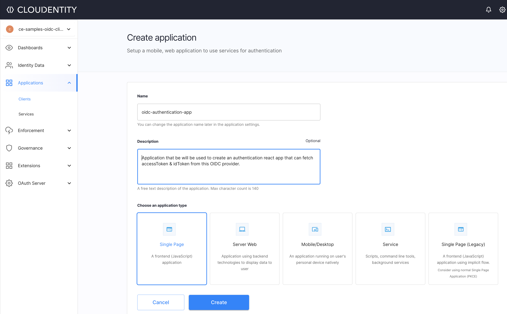
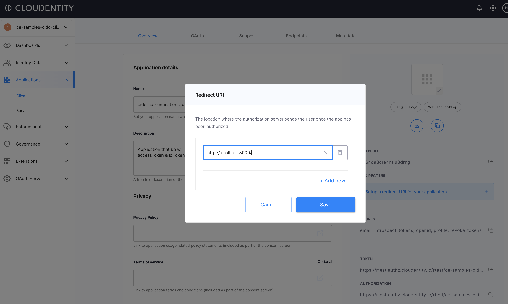
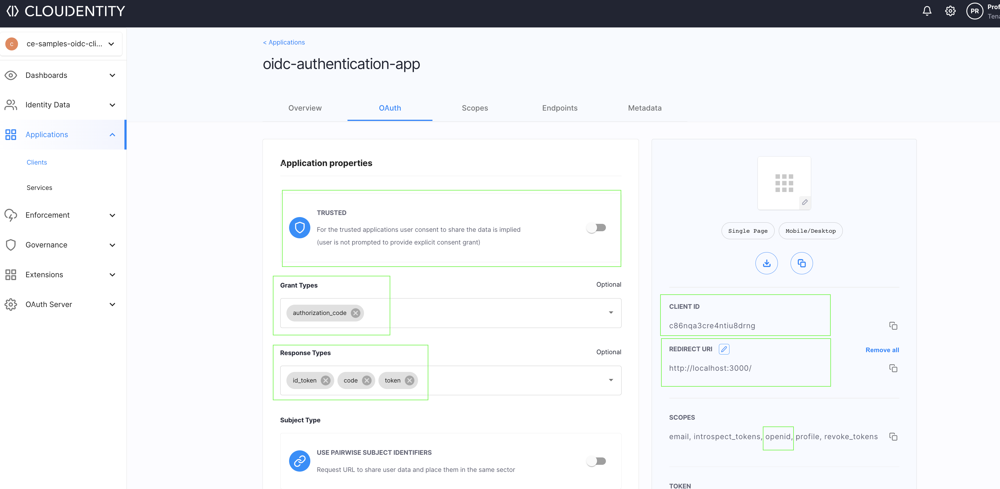

# OIDC authentication app in React using Cloudentity as OIDC provider

In this article, we will be creating a React based front-end application that
will serve as an authentication application template. In this modern stack, we will
be using OAuth Authorization code flow with PKCE to fetch the `idToken` that
represents the identity of the authenticated user. We will use Cloudentity Authorization Platform as the OIDC provider. Cloudentity platform can plug in into any of your existing
Identity providers like Okta, Auth0, Google, Facebook etc and abstracts away the 
dependency of the application on an identity provider and acts like pure open standard
compliant OAuth and OIDC server. This way the application is integrated with Cloudentity as OIDC provider via the open standard specifications.

### Prerequisites

#### Cloudentity SaaS Tenant

Cloudentity offers [free SaaS Tenant](https://authz.cloudentity.io/register) and you can sign up for one, if you have not already for a [free account](https://authz.cloudentity.io/register). With this you are basically getting a free OAuth/OIDC compliant server  with all of the latest specifications comprising of OpenData initiatives across the world.

#### React app

- [Node.js](https://nodejs.org) - Recommended v16.x +
- [npm](https://docs.npmjs.com/getting-started) - Recommended v8.x +

### Building the React application

#### Initialize React app

```bash
npx create-react-app oidc-auth-sample-app
cd oidc-auth-sample-app
```

We'll install packages required for minimal functionality:

* react-router-dom - client-side routing for react
* cloudentity/auth - Cloudentity JS SDK to fetch and store OAuth access tokens
* jwt-decode - decode JWT tokens, such as OAuth access tokens and OIDC id tokens

```bash
npm install --save react-router-dom @cloudentity/auth jwt-decode
```

NOTE: We are utilizing the cloudentity/auth package to minimize the plumbing work
to handle the OAuth authorization code with PKCE flow. 

### Define React components

To keep our app organized, let's create a `components` directory and create some basic [react components](https://reactjs.org/docs/react-api.html#reactcomponent)

`Login.js`   - view for unauthenticated traffic
`Profile.js` -  view for authenticated users.

```bash
mkdir src/components && cd src/components
```
Now we add some very basic content to the `Login` and `Profile` components.

Create a file named `Login.js` with below contents:

```js
const Login = () => {
  return (
    <div>
      <h1>Welcome!</h1>
      <button>
        Please log in.
      </button>
    </div>
  );
};

export default Login;
```

Create another file named `Profile.js` with below contents:

```js
const Profile = () => {
  return (
    <div>
      <h1>Welcome, { /* we'll dynamically populate this soon */ 'user' }!</h1>
      <h3>
        Your profile info:
      </h3>
      <div>
        { /* we'll dynamically populate this soon */ }
      </div>
    </div>
  );
};

export default Profile;
```


#### Routing

Let's define some routing within the React application. 
** The index route (`/`) will not require authorization , so any users who are not authorized will be redirected to this route.
** The profile route (`/profile`) will require authorization to access. After login, authorized users will be redirected to this route.

We will use [`react-router-dom`](https://v5.reactrouter.com/web/guides/quick-start) package to handle routing.

We will be building these routes in phases `/` and `/profile` routes pointing to them. At this point, anyone can visit them without authorization.

Let's modify the default `src/App.js` to include above `Routes` and also import
the view components for `Login` and `Profile`

```js
import {
  BrowserRouter,
  Routes,
  Route
} from 'react-router-dom';
import Login from './components/Login';
import Profile from './components/Profile';
import './App.css';

function App() {
  return (
    <div className="App">
      <BrowserRouter>
        <Routes>
          <Route index element={<Login />} />
          <Route path="profile" element={<Profile />} />
        </Routes>
      </BrowserRouter>
    </div>
  );
}

export default App;
```

Let's do some basic styling for App by editing `src/App.css`, we'll modify the `App` class to look like this, and discard everything else. You may choose to style it for your needs

```css
.App {
  min-height: 100vh;
  display: flex;
  flex-direction: column;
  align-items: center;
  justify-content: center;
  text-align: center;
}
```

#### Start the dev server:

```bash
npm start
```

Navigate to [http://localhost:3000](http://localhost:3000), you'll see the Login view, and if you go directly to [http://localhost:3000/profile](http://localhost:3000/profile), you'll see the Profile view. We have not applied the authorization logic to the routes yet, so let's move to protecting the profile view to be accessible for authorized users.

Authorized users are represented in this application by the presence of a valid `idToken` 
fetched from an OIDC provider(in this case Cloudentity authorization platform). In this
application, if a valid `idToken` is not available, then this application will reach out
to OIDC provider to mint a new token for usage.

So let's register this application with the OIDC provider to fetch an `idToken`

#### Register a OAuth client application with OIDC provider

In this article, we are using Cloudentity authorization platform as the OIDC provider and sign up for a [free SaaS Tenant](https://authz.cloudentity.io/register), in case you have not already done to proceed further.

Once you are in the Cloudentity authorization platform, take the guided tour to understand the platform capabilities and after that let's go register a [public `OAuth Client Application`](https://datatracker.ietf.org/doc/html/rfc6749#page-13). We choose the client application type as `public` as this is a single page application with no trusted backend and there should NOT be any client secrets/credentials used in this application OAuth flow. So that means we will be using [OAuth authorization code with PKCE flow - RFC7636](https://datatracker.ietf.org/doc/html/rfc7636) for securely obtaining the [`idToken`](https://openid.net/specs/openid-connect-core-1_0.html#IDToken) which represents an authenticated end user.

So let's go ahead and create OAuth client application that is secure and is configured to satisfy above flow requirement in Cloudentity.

Navigate to `Applications > Clients` and click on "Create Application.". Provide an appropriate name (we will be using 'react-demo' for this example) and select "Single Page" for the application type. We chose `Single Page` as this is a public application that is loaded onto browser.



Now, let's add a redirect URL for this application. As per OAuth specification, once the interaction with an authentication system is complete, this is the URL to which the OAuth/OIDC provider, in this case Cloudentity platform will responding with the authorization code. So basically the React application should be able to handle this incoming authorization code(which in this case will be handled by the cloudentity/auth library) and process it further. By default, since this app runs at `http://localhost:3000` but in case you have hosted this app somewhere else, then add that URL in here. 



Now we have completed registering the OAuth client application in Cloudentity authorization platform. Let's look at some of the highlighted fields in below diagram for solidfying our understanding



** Trusted app - This should be turned off as this is a single page app that is completely run in an end user browser/device
** grant type - indicated that we are using the recommended `authorization code ` grant flow
** response type - indicates that we need id token back in response
** client id - identifier of the client application
** redirect uri - URL to which the Cloudentity platform will send back the `authorization code` if authorized successfully, if not error response will be returned
** scope - set of scopes that is required for OIDC flow, we do require `openid` scope to retrieve the subject identifier

More a more detailed guide, [checkout our product guide articles](https://docs.authorization.cloudentity.com/guides/developer/protect/application/create_app/) but above setup should be enough to get you going.

#### Configuring the React app with OIDC provider

As we pointed our earlier, we will use the Cloudentity Auth library to wrap the entire handling of the OAuth handshake flows that includes pkce code generation, authorize call, exchange code for tokens etc. So let's configure the Cloudentity Auth library in our app
with the registered client data.

To set up the configuration for the library

```bash
touch src/authConfig.js
```


 protect the Profile view from unauthorized traffic, and ensure authorized and non-authorized users get redirected to the correct route.

First, we need to set up a config file that will contain our Cloudentity ACP OAuth application values, and a file for an auth hook that we can use in our components to check whether the user is authorized to access a certain view.

Create a file name `authConfig.js` under `src`

`src/authConfig.js` contains the configuration required to handshake with the Cloudentity authorization platform to obtain an `accessToken` to consume resources on behalf of an end user, and an `idToken` to provide identity data. The underlying Cloudentity SDK uses the authorization code grant with PKCE flow to get the accessToken. [Read more about the OAuth PKCE flow](https://docs.authorization.cloudentity.com/features/oauth/grant_flows/auth_code_with_pkce/).

In `src/authConfig.js`, replace the example values with values from the OAuth Application you set up.

```js
const authConfig = {
    domain: 'example.authz.cloudentity.io', // e.g. 'example.authz.cloudentity.io.' Recommended; always generates URLs with 'https' protocol.
     // baseUrl: optional alternative to 'domain.' Protocol required, e.g. 'https://example.demo.cloudentity.com.'
     // In situations where protocol may dynamically resolve to 'http' rather than 'https' (for example in dev mode), use 'baseUrl' rather than 'domain'.
     tenantId: 'example', // This is generally in the subdomain of your Cloudentity ACP URL
     authorizationServerId: 'demo', // This is generally the name of the workspace you created the OAuth application in.
     clientId: 'application-client-id-goes-here',
     redirectUri: 'http://localhost:3000/',
     scopes: ['profile', 'email', 'openid'], // 'revoke_tokens' scope must be present for 'logout' action to revoke token! Without it, token will only be deleted from browser's local storage.
     accessTokenName: 'profile_demo_access_token', // optional; defaults to '{tenantId}_{authorizationServerId}_access_token'
     idTokenName: 'profile_demo_id_token', // optional; defaults to '{tenantId}_{authorizationServerId}_id_token'
 };

 export default authConfig;
```

Now let's create a React hook to manage the state whether user is authenticated or not.

In `src/auth.js`, we'll create a simple hook to manage our authenticated state:

```js
import {useState, useEffect} from 'react';

export const useAuth = (auth) => {
  const [authenticated, setAuthentication] = useState(null);

  function removeQueryString() {
    if (window.location.href.split('?').length > 1) {
      window.history.replaceState({}, document.title, window.location.href.replace(/\?.*$/, ''));
    }
  }

  useEffect(() => {
    auth.getAuth().then((res) => {
      if (res) {
        console.log('auth response:', JSON.stringify(res));
        removeQueryString();
      }
      setAuthentication(true);
    })
    .catch((_authErr) => {
      setAuthentication(false);
      if (window.location.href.split('?error').length > 1) {
        if (authenticated === false) {
          window.alert('The authorization server returned an error.');
        }
      } else {
        removeQueryString();
      }
    });
  });

  return [authenticated];
};
```

Now we have all the building blocks to wire the OAuth flow with OIDC provider(Cloudentity authorization platform) to our React app.

We will use the Cloudentity Auth SDK to handle OAuth authorization (code => token exchange), redirects and
setting the `accessToken`. If an `accessToken` is not available in the local storage, the user
will be redirected to the `/` route, where they will see the "Please log in" button. They will not be able to access the `/profile` route.

As the last step, let's go back to `src/App.js`, and import the Cloudentity Auth SDK, registered oAuth client application config, and the auth hook; we'll then add login and logout handlers to pass as props to our Login and Profile components:

```js
// ...

import CloudentityAuth from '@cloudentity/auth';
import authConfig from './authConfig';
import { useAuth } from './auth';

function App() {
  const cloudentity = new CloudentityAuth(authConfig);
  const [authenticated] = useAuth(cloudentity);

  function authorize () {
    cloudentity.authorize();
  };

  function clearAuth () {
    cloudentity.revokeAuth()
      .then(() => {
        window.location.reload();
      })
      .catch(() => {
        window.location.reload();
      });
  };

  return (
    <div className="App">
      <BrowserRouter>
        <Routes>
          <Route index element={<Login auth={authenticated} handleLogin={authorize} />} />
          <Route path="profile" element={<Profile auth={authenticated} handleLogout={clearAuth} />} />
        </Routes>
      </BrowserRouter>
    </div>
  );
}

// ...
```

Now we just need to wire up our Login and Profile components to detect the auth state and redirect if necessary.

In `src/components/Login.js`:

```js
import { Navigate } from 'react-router-dom';

const Login = ({auth, handleLogin}) => {
  return (
    <div>
      {auth === null && <div>Loading...</div>}
      {auth === false && (
        <div>
          <h1>Welcome!</h1>
          <button onClick={handleLogin}>
            Please log in.
          </button>
        </div>
      )}
      {auth && <Navigate to='/profile' />}
    </div>
  );
};

export default Login;
```

In `src/components/Profile.js`:

```js
import { Navigate } from 'react-router-dom';

const Profile = ({auth, handleLogout}) => {
  return (
    <div>
      {auth === null && <div>Loading...</div>}
      {auth === false && <Navigate to='/' />}
      {auth && (
        <div>
          <h1>Welcome, { /* we'll dynamically populate this soon */ 'user' }!</h1>
          <h3>
            Your profile info:
          </h3>
          <div>
            { /* we'll dynamically populate this soon */ }
          </div>
          <button onClick={handleLogout} style={{marginTop: 20}}>
            Log out
          </button>
        </div>
      )}
    </div>
  );
};

export default Profile;
```

Note that there is both a `false` and `null` state for `auth`. This is because checking the auth state is asynchronous, so when redirecting to our app after the OAuth handshake, there will be a brief moment where our app has rendered but the auth check is not finished. To handle this, we'll display a message that reads "Loading..." in that brief moment after the successful redirect from the Cloudentity ACP OAuth application.

The one thing remaining is to extract the user's identity data from the OAuth ID token and display it in their profile view. To do this, we'll import the `jwt-decode` library into our Profile page, and add a simple list of profile attributes. Parameters such as `iat` or 'issued at,' which can allow us to display a human-readable last login time, are returned as Unix timestamps and must be converted.

After adding some profile data and minimal styles, here's our finished `src/components/Profile.js` file:

```js
import { Navigate } from 'react-router-dom';
import jwt_decode from 'jwt-decode';
import authConfig from '../authConfig';

const Profile = ({auth, handleLogout}) => {
  const idToken = window.localStorage.getItem(authConfig.idTokenName);
  const idTokenData = idToken ? jwt_decode(idToken) : {};
  const lastLogin = idTokenData.iat ? (new Date(idTokenData.iat*1000)).toLocaleString() : 'N/A';

  console.log(idTokenData, lastLogin, idTokenData.iat);

  const profileItemStyle = {
    display: 'flex',
    justifyContent: 'space-between'
  };

  const profileLabelStyle = {
    fontWeight: 'bold'
  };

  return (
    <div>
      {auth === null && <div>Loading...</div>}
      {auth === false && <Navigate to='/' />}
      {auth && (
        <div>
          <h1>Welcome, {idTokenData.sub || 'user'}!</h1>
          <h3>
            Your profile info:
          </h3>
          <div style={{marginTop: 20, minWidth: 270}}>
            <div style={profileItemStyle}>
              <div style={profileLabelStyle}>Username:</div>
              <div>{idTokenData.sub}</div>
            </div>
            <div style={profileItemStyle}>
              <div style={profileLabelStyle}>Email:</div>
              <div>{idTokenData.email || 'N/A'}</div>
            </div>
            <div style={profileItemStyle}>
              <div style={profileLabelStyle}>Last login:</div>
              <div>{lastLogin}</div>
            </div>
          </div>
          <button onClick={handleLogout} style={{marginTop: 20}}>
            Log out
          </button>
        </div>
      )}
    </div>
  );
};

export default Profile;
```

Now you should see your username, email (if your logged-in user has one configured), and last login time.

This is just the beginning; we can use the `accessToken` as well to call protected API endpoints, which we'll be exploring in another article.

### Conclusion

This wraps up our tutorial for a simple Login and Profile page protected using the Cloudentity Authorization platform.
After going through the tutorial, you will have accomplished the following:
 * Create an OAuth Application with the Cloudentity Authorization Platform
 * Build a simple React UI application with a login and profile page
 * Authorize and set OAuth access and ID tokens in your React app
 * Manage redirects between Login and Profile pages for authorized and unauthorized users
 * Display basic profile info on the profile page for authorized users
